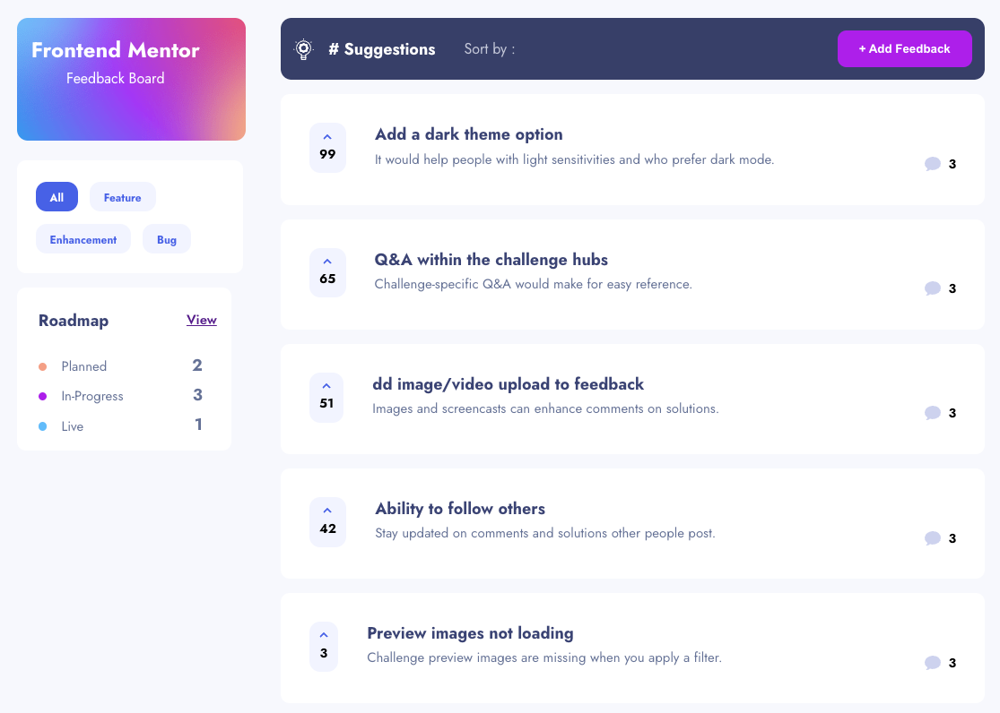
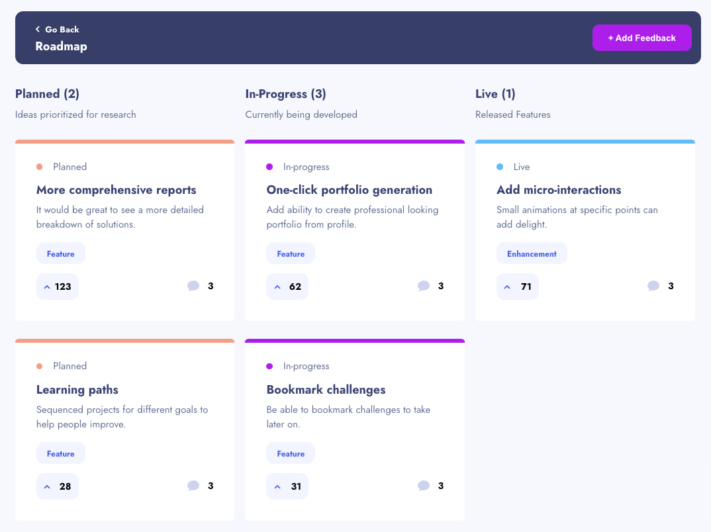
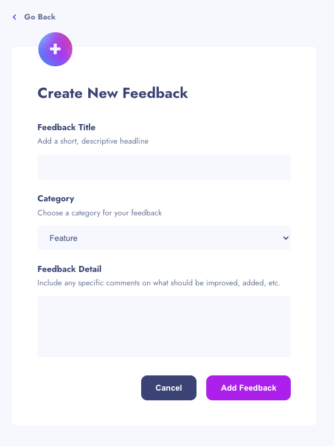

# Product Feedback App

This project was bootstrapped with [Create React App](https://github.com/facebook/create-react-app).

## Table of contents
- [Product Feedback App](#product-feedback-app)
  - [Table of contents](#table-of-contents)
  - [Task](#task)
  - [Screenshot](#screenshot)
  - [Detailed Requirements](#detailed-requirements)
  - [Expected Behaviour](#expected-behaviour)
  - [My Process](#my-process)
  - [What I Learned](#what-i-learned)
  - [Deployment](#deployment)
  - [Continued Development](#continued-development)
  - [Author](#author)

## Task

Build a product feedback app, with the ability to create, read, update & delete product feedback requests.

## Screenshot

## Detailed Requirements

Users should be able to:

- View the optimal layout for the app depending on their device's screen size
- See hover states for all interactive elements on the page
- Create, read, update, and delete product feedback requests
- Receive form validations when trying to create/edit feedback requests
- Sort suggestions by most/least upvotes and most/least comments
- Filter suggestions by category
- Add comments and replies to a product feedback request
- Upvote product feedback requests
- **Bonus**: Keep track of any changes, even after refreshing the browser (`localStorage` could be used for this if you're not building out a full-stack app)

## Expected Behaviour

- Suggestions page
  - Only product feedback requests with a status of `suggestion` should be shown on the Suggestions page.
- Roadmap
  - Feedback requests with a status of `planned`, `in-progress`, or `live` should show up on the roadmap, and should be placed in the correct column based on their status.
  - Columns should be ordered by upvote totals.
- Creating a product request
  - When creating a new piece of feedback, an ID needs to be assigned which increments the current highest product request ID by 1.
  - The default status for a new piece of feedback is `suggestion`. This places it on the Suggestions page.
- Editing feedback
  - If a piece of feedback has its status updated to `planned`/`in-progress`/`live` it moves through to the roadmap and should show up in the correct column based on its new status.
- Add comments/replies
  - Use the data from the `currentUser` object in the `data.json` file to populate the user data for any new comments or replies.
  - Any comment/reply can have a maximum of 250 characters.

## My Process

I decided to make this as a fullstack app. I converted the included data.json to PostgreSQL tables.
No login was used for this project so I just went with a single, hard coded user for adding new feedback
and replies.

[+] Frontend - React
[+] Backend - Node.js with KOA
[+] Database - PostgreSQL hosted on https://railway.app/
[+] CSS - a global CSS file, with SASS CSS modules for page/component specific CSS - Flexbox

I tried to plan ahead and be as organized as possible when approaching this design. With this in mind I went
with a CSS variables and a global CSS file for reusable CSS, where possible.

## What I Learned

Each time I pursue a new project, I learn was to improve my process. Being as thorough as possible when thinking through
the React data flow can save you a lot of time. Both in troubleshooting what your data is not what you think it should be,
as well as minimizing having to refactor components to change how state is passed around the app.

It also took some thinking about how the database should be set up based on how the data.json file was structured.

This was also my first time using React Router 6.14, which structures things a bit differently.

As always it feels good when you get something to work and have those Aha moments when a problem is solved and things work as they should.

## Deployment

Deployed to Vercel: https://product-feedback-app-ochre.vercel.app/

Node backend and React Frontend are deployed as two separate projects on Vercel.

## Continued Development

Still to be completed:
[+] Form validation
[+] Mobile CSS

## Author

- Frontend Mentor - [@chrtravels](https://www.frontendmentor.io/profile/chrtravels)
